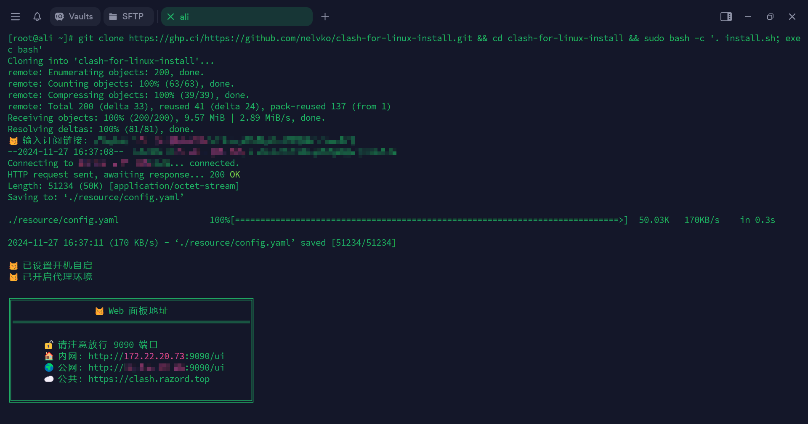

# Linux 一键安装 Clash

因为有在服务器上使用代理的需求，试过大部分的开源脚本，总是遇到各种问题。于是自己动手，丰衣足食。对安装过程及后续使用进行了友好封装，部署使用起来优雅、简单、明确。

基于 `Clash` 项目作者删库前最新的 `Premium` 版本，如有需求可自行更换版本。

文末[引用](#引用)中收集了各种内核和 `GUI` 客户端版本的下载地址。



## 环境要求

- 需要 `root` 或 `sudo` 权限。
- 具备 `bash` 和 `systemd` 的系统环境。
- 已适配：`CentOS 7.x`、`Debian 12.x`、`Ubuntu 24.x`

## 快速开始

### 一键安装脚本

> [!NOTE]
>
> [常见问题](#常见问题)

```bash
git clone https://ghp.ci/https://github.com/nelvko/clash-for-linux-install.git && cd clash-for-linux-install && sudo bash -c '. install.sh; exec bash'
```

- 上述脚本已使用[代理加速下载](https://ghp.ci/)，如失效请自行更换。

- ~~不懂什么是订阅链接的小白可参考~~：[issue#1](https://github.com/nelvko/clash-for-linux-install/issues/1)

- 没有订阅？[click me](https://次元.net/auth/register?code=oUbI)

### Command

以下命令已集成到全局配置文件 `bashrc` 中，可直接在终端执行。

```bash
$ clashoff
😼 已关闭代理环境

$ clashon
😼 已开启代理环境

$ clashui
😼 Web 面板地址...

$ clashsecret
😼 当前密钥：''

$ clashupdate <url>
😼 配置更新成功，已重启生效

$ clashupdate log
2024-12-13 23:38:56 配置更新成功✅
```

- 使用 `systemctl` 控制 `clash` 启停后，还需调整代理环境变量的值（http_proxy 等），因为`wget`、`curl` 等命令会读取代理变量发送请求。
- 以上命令集成了上述流程。

### 定时更新配置

```bash
$ clashupdate --auto <url>
😼 定时任务设置成功
```

- 将命令末尾的 `url` 替换为你的订阅链接，执行一次即可。会新建定时任务，每两天自动下载并覆盖配置文件。
- 可通过 `crontab -e` 来修改更新频率及订阅链接。

### Web 控制台设置密钥（推荐）

```bash
$ clashsecret <secret>
😼 密钥更新成功，已重启生效
```

- 启动时指定，优先级大于配置文件，更新订阅后不会丢失。
- 可修改文件 `/etc/systemd/system/clash.service` 来指定其他启动参数。

### 卸载

```bash
sudo bash -c '. uninstall.sh; exec bash'
```

## 常见问题

### 下载失败或配置无效

- 下载失败：脚本使用 `wget`、`curl`
  命令进行了多次[重试](https://github.com/nelvko/clash-for-linux-install/blob/035c85ac92166e95b7503b2a678a6b535fbd4449/script/common.sh#L32-L46)
  下载，如果还是失败可能是机场限制，请自行粘贴内容到配置文件：[issue#1](https://github.com/nelvko/clash-for-linux-install/issues/1#issuecomment-2066334716)

- 订阅配置无效：[issue#14](https://github.com/nelvko/clash-for-linux-install/issues/14#issuecomment-2513303276)

### bash: clashon: command not found

- 原因：使用 `bash install.sh` 执行脚本不会对当前 `shell` 生效。

- 解决：当前 `shell` 执行下 `bash`。

- <details>

  <summary>几种运行方式的区别：</summary>

    - `bash` 命令运行：当前 `shell` 开启一个子 `shell` 执行脚本，对环境的修改不会作用到当前 `shell`，因此不具备 `clashon`
      等命令。

      ```bash
      # 需要有可执行权限
      $ ./install.sh
      # 不需要可执行权限，需要读权限
      $ bash ./install.sh
      ```

    - `shell` 内建命令运行：脚本在当前 `shell` 环境中执行，变量和函数的定义对当前 `shell` 有效，`root` 用户推荐这种方式执行脚本。

      ```bash
      # 不需要可执行权限，需要读权限
      $ . install.sh
      $ source uninstall.sh
      ```

  </details>

### 服务启动失败/未启动

- [端口占用](https://github.com/nelvko/clash-for-linux-install/issues/15#issuecomment-2507341281)
- [系统为 WSL 环境或不具备 systemd](https://github.com/nelvko/clash-for-linux-install/issues/11#issuecomment-2469817217)

## 引用

- [clash-linux-amd64-v3-2023.08.17.gz](https://downloads.clash.wiki/ClashPremium/)
- [Clash Web Dashboard](https://github.com/haishanh/yacd/releases/tag/v0.3.8)
- [Clash 全家桶下载](https://www.clash.la/releases/)
- [Clash 知识库](https://clash.wiki/)

## Todo

- [x] 定时更新配置
- [x] 😼
- [x] 适配其他发行版
- [x] 配置更新日志
- [ ] Tun 模式
- [ ] mixin 配置
- [ ] [bug / 需求](https://github.com/nelvko/clash-for-linux-install/issues)

## Thanks

[@鑫哥](https://github.com/TrackRay)

## 特别声明

1. 编写本项目主要目的为学习和研究 `Shell` 编程，不得将本项目中任何内容用于违反国家/地区/组织等的法律法规或相关规定的其他用途。

2. 本项目保留随时对免责声明进行补充或更改的权利，直接或间接使用本项目内容的个人或组织，视为接受本项目的特别声明。
