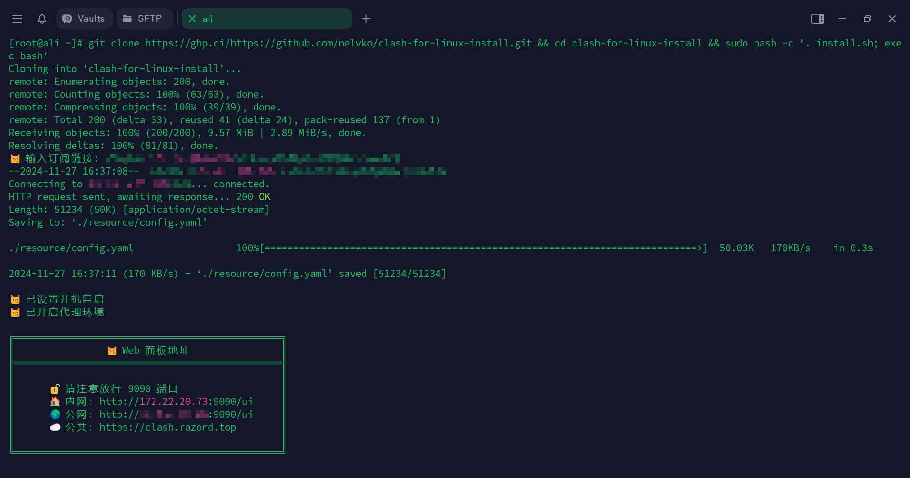

# Linux 一键安装 Clash




## ✨ 功能特性

- 支持一键安装 `mihomo` 与 `clash` 代理内核。
- 兼容 `root` 与普通用户环境。
- 适配主流 `Linux` 发行版，并兼容 `AutoDL` 等容器化环境。
- 自动检测端口占用情况，在冲突时随机分配可用端口。
- 自动识别系统架构与初始化系统，下载匹配的内核与依赖，并生成对应的服务管理配置。
- 在需要时调用 [subconverter](https://github.com/tindy2013/subconverter) 进行本地订阅转换。

## 🚀 一键安装

在终端中执行以下命令即可完成安装：

```bash
git clone --branch master --depth 1 https://gh-proxy.org/https://github.com/nelvko/clash-for-linux-install.git \
  && cd clash-for-linux-install \
  && bash install.sh
```

- 上述命令使用了[加速前缀](https://gh-proxy.org/)，如失效可更换其他[可用链接](https://ghproxy.link/)。
- 可通过 `.env` 文件或脚本参数自定义安装选项。
- 没有订阅？[click me](https://次元.net/auth/register?code=oUbI)

## ⌨️ 命令一览

```bash
Usage: 
  clashctl COMMAND [OPTIONS]

Commands:
    on                    开启代理
    off                   关闭代理
    status                内核状况
    proxy                 系统代理
    ui                    Web 面板
    secret                Web 密钥
    sub                   订阅管理
    upgrade               升级内核
    tun                   Tun 模式
    mixin                 Mixin 配置

Global Options:
    -h, --help            显示帮助信息
```

💡`clashon` 同 `clashctl on`，`Tab` 补全更方便！

### 优雅启停

```bash
$ clashon
😼 已开启代理环境

$ clashoff
😼 已关闭代理环境
```
- 在启停代理内核的同时，同步设置系统代理。
- 亦可通过 `clashproxy` 单独控制系统代理。

### Web 控制台

```bash
$ clashui
╔═══════════════════════════════════════════════╗
║                😼 Web 控制台                  ║
║═══════════════════════════════════════════════║
║                                               ║
║     🔓 注意放行端口：9090                      ║
║     🏠 内网：http://192.168.0.1:9090/ui       ║
║     🌏 公网：http://8.8.8.8:9090/ui          ║
║     ☁️ 公共：http://board.zash.run.place      ║
║                                               ║
╚═══════════════════════════════════════════════╝

$ clashsecret mysecret
😼 密钥更新成功，已重启生效

$ clashsecret
😼 当前密钥：mysecret
```

- 可通过浏览器打开 `Web` 控制台进行可视化操作，例如切换节点、查看日志等。
- 默认使用 [zashboard](https://github.com/Zephyruso/zashboard) 作为控制台前端，如需更换可自行配置。
- 若需将控制台暴露到公网，建议定期更换访问密钥，或通过 `SSH` 端口转发方式进行安全访问。

### `Mixin` 配置

```bash
$ clashmixin
😼 查看 Mixin 配置

$ clashmixin -e
😼 编辑 Mixin 配置

$ clashmixin -c
😼 查看原始订阅配置

$ clashmixin -r
😼 查看运行时配置
```

- 通过 `Mixin` 自定义的配置内容会与原始订阅进行深度合并，且 `Mixin` 具有最高优先级，最终生成内核启动时加载的运行时配置。
- `Mixin` 支持以前置、后置或覆盖的方式，对原始订阅中的规则、节点及策略组进行新增或修改。

### 升级内核
```bash
$ clashupgrade
😼 请求内核升级...
{"status":"ok"}
😼 内核升级成功
```
- 升级过程由代理内核自动完成；如需查看详细的升级日志，可添加 `-v` 参数。
- 建议通过 `clashmixin` 为 `github` 配置代理规则，以避免因网络问题导致请求失败。

### 管理订阅

```bash
$ clashsub -h
Usage: 
  clashsub COMMAND [OPTIONS]

Commands:
  add <url>       添加订阅
  ls              查看订阅
  del <id>        删除订阅
  use <id>        使用订阅
  update [id]     更新订阅
  log             订阅日志


Options:
  update:
    --auto        配置自动更新
    --convert     使用订阅转换
```

- 支持添加本地订阅，例如：`file:///root/clashctl/resources/config.yaml`
- 当订阅链接解析失败或包含特殊字符时，请使用引号包裹以避免被错误解析。
- 自动更新任务可通过 `crontab -e` 进行修改和管理。

### `Tun` 模式

```bash
$ clashtun
😾 Tun 状态：关闭

$ clashtun on
😼 Tun 模式已开启
```

- 作用：实现本机及 `Docker` 等容器的所有流量路由到 `clash` 代理、DNS 劫持等。
- 原理：[clash-verge-rev](https://www.clashverge.dev/guide/term.html#tun)、 [clash.wiki](https://clash.wiki/premium/tun-device.html)。
- 若订阅中的节点 `server` 使用域名，默认 `mixin.yaml` 已预置 `proxy-server-nameserver`，可避免开启 `Tun` + `fake-ip` 后节点域名被解析为 fake-ip 而导致代理握手失败；如使用自定义 DNS 配置，建议保留该项，并在必要时再配合 `fake-ip-filter`。
- 注意事项：[#100](https://github.com/nelvko/clash-for-linux-install/issues/100#issuecomment-2782680205)

## 🗑️ 卸载

```bash
bash uninstall.sh
```

## 📖 常见问题

👉 [Wiki · FAQ](https://github.com/nelvko/clash-for-linux-install/wiki/FAQ)

## 🔗 引用

- [clash](https://clash.wiki/)
- [mihomo](https://github.com/MetaCubeX/mihomo)
- [subconverter](https://github.com/tindy2013/subconverter)
- [yq](https://github.com/mikefarah/yq)
- [zashboard](https://github.com/Zephyruso/zashboard)

## ⭐ Star History

<a href="https://www.star-history.com/#nelvko/clash-for-linux-install&Date">

 <picture>
   <source media="(prefers-color-scheme: dark)" srcset="https://api.star-history.com/svg?repos=nelvko/clash-for-linux-install&type=Date&theme=dark" />
   <source media="(prefers-color-scheme: light)" srcset="https://api.star-history.com/svg?repos=nelvko/clash-for-linux-install&type=Date" />
   
 </picture>
</a>

## 🙏 Thanks

[@鑫哥](https://github.com/TrackRay)

## ⚠️ 特别声明

1. 编写本项目主要目的为学习和研究 `Shell` 编程，不得将本项目中任何内容用于违反国家/地区/组织等的法律法规或相关规定的其他用途。
2. 本项目保留随时对免责声明进行补充或更改的权利，直接或间接使用本项目内容的个人或组织，视为接受本项目的特别声明。
