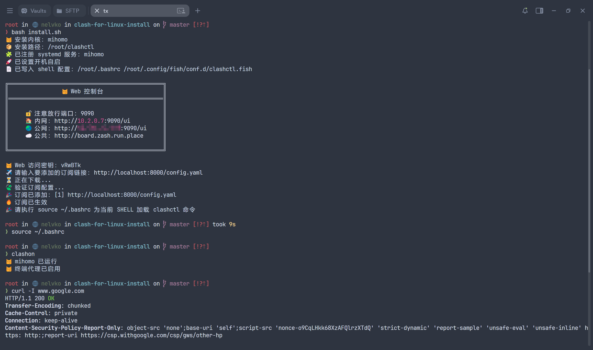

<h1 align="center">
  clashctl
</h1>

<p align="center">mihomo / clash 一键部署与管理工具</p>

<p align="center">
  
  
  
  <a href="https://deepwiki.com/nelvko/clash-for-linux-install"></a>
</p>

## 📸 Preview



## ✨ Features

- **开箱即用**：一键部署 `mihomo` / `clash` 内核、Web 面板及运行依赖。
- **广泛兼容**：支持 `root` / 普通用户，适配主流 `Linux` 发行版、容器环境、`systemd` / `OpenRC` 等 `init` 系统，以及 `macOS launchd`。
- **统一管理**：通过 `clashctl` 管理代理启停、状态查看、日志追踪、Web 面板、TUN 模式、访问密钥与内核升级等。
- **订阅管理**：支持多订阅源配置、一键切换、定时更新，并集成 [subconverter](https://github.com/tindy2013/subconverter) 实现订阅格式转换。

## 🚀 Installation

在终端中执行以下命令即可完成安装：

```bash
git clone --branch master --depth 1 https://gh-proxy.org/https://github.com/nelvko/clash-for-linux-install.git \
  && cd clash-for-linux-install \
  && bash install.sh
```

- 上述命令使用了[加速前缀](https://gh-proxy.org/)，如失效请更换其他[可用链接](https://ghproxy.link/)。
- 可通过 `.env.install` 文件自定义安装选项。
- `macOS` 目前仅支持 `mihomo` 内核。
- 没有订阅？[click me](https://次元.net/auth/register?code=oUbI)

## 📖 Documentation

- [Usage](https://github.com/nelvko/clash-for-linux-install/wiki) — 命令用法与示例。
- [FAQ](https://github.com/nelvko/clash-for-linux-install/wiki/FAQ) — 常见问题。

## 💖 Support

###  [Maru Code —— 稳定可靠的 API 中转服务](https://api.muteki.site/register?aff=NELVKO)

- ⚡ 模型能力完整，`Claude` 系列满血可用。
- 📊 计费倍率透明公开，成本更容易预估。
- 🔑 自营号池保障可用性，日常调用更稳定。
- 🎁 新用户注册赠送 `$2` 额度：👉[立即注册](https://api.muteki.site/register?aff=NELVKO&promo=nelvko)

## ⭐ Star History

<a href="https://www.star-history.com/#nelvko/clash-for-linux-install&Date">
 <picture>
   <source media="(prefers-color-scheme: dark)" srcset="https://api.star-history.com/svg?repos=nelvko/clash-for-linux-install&type=Date&theme=dark" />
   <source media="(prefers-color-scheme: light)" srcset="https://api.star-history.com/svg?repos=nelvko/clash-for-linux-install&type=Date" />
   
 </picture>
</a>

## ⚠️ Disclaimer

- 编写本项目主要目的为学习和研究 `Shell` 编程，不得将本项目中任何内容用于违反国家/地区/组织等的法律法规或相关规定的其他用途。
- 本项目保留随时对免责声明进行补充或更改的权利，直接或间接使用本项目内容的个人或组织，视为接受本项目的特别声明。
