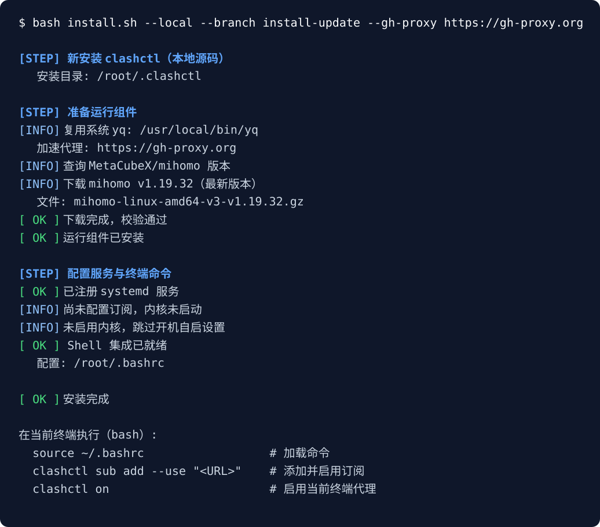

<h1 align="center">
  clashctl
</h1>

<p align="center">mihomo / clash 一键部署与管理工具</p>

<p align="center">
  <a href="https://www.star-history.com/nelvko/clash-for-linux-install">
    <picture>
      <source media="(prefers-color-scheme: dark)" srcset="https://api.star-history.com/badge?repo=nelvko/clash-for-linux-install&type=rank&theme=dark" />
      <source media="(prefers-color-scheme: light)" srcset="https://api.star-history.com/badge?repo=nelvko/clash-for-linux-install&type=rank" />
      
    </picture>
  </a>
</p>

<p align="center">
  
  
  
  <a href="https://deepwiki.com/nelvko/clash-for-linux-install"></a>
</p>




## ✨ 特性

- 支持 `mihomo` / `clash` 内核，默认使用 `mihomo`，Web 面板和订阅转换器按需下载。
- 支持 `root` / 普通用户、容器环境，适配 `systemd` / `OpenRC` 等服务管理方式。
- 通过 `clashctl` 开关终端代理、启停内核、切换节点、查看日志，管理 Web 面板、TUN 模式和访问密钥。
- 支持添加、切换和更新多个订阅，非原生订阅可通过 [subconverter](https://github.com/tindy2013/subconverter) 转换；自定义配置写入 Mixin，订阅更新后仍保留。
- 支持脚本更新和旧版迁移，保留已有订阅与配置。

## 📦 安装

执行以下命令安装或更新 `clashctl`：

```bash
GH_PROXY=https://gh-proxy.org/
curl -fsSL "${GH_PROXY}https://raw.githubusercontent.com/nelvko/clash-for-linux-install/HEAD/install.sh" | \
  bash -s -- --gh-proxy "$GH_PROXY"
```

默认安装到 `~/.clashctl`。安装完成后，按提示加载命令，或重新打开终端。

- `GH_PROXY`：[GitHub 加速下载代理](https://gh-proxy.org/)
- [自定义安装选项](https://github.com/nelvko/clash-for-linux-install/wiki/User-Guide#安装选项)
- 没有订阅？[获取订阅](https://次元.net/auth/register?code=oUbI)

## 🚀 快速上手

添加并启用订阅，若安装时已配置可跳过：

```bash
clashctl sub add --use "<订阅链接>"
```

开启当前终端代理：

```bash
# 自动启动内核，并开启当前终端代理
clashctl on

# 测试连通性
curl -I https://www.google.com
```

可以在终端切换节点，也可以打开 Web 面板操作：

```bash
clashctl node            # 切换节点
clashctl ui              # 查看面板地址
clashctl secret          # 查看登录密钥
```

日常管理：

```bash
clashctl sub             # 切换订阅
clashctl sub update      # 更新当前订阅
clashctl status          # 查看内核状态
clashctl log             # 查看内核日志
clashctl mixin -e        # 编辑自定义配置
```

关闭代理或停止内核：

```bash
# 仅清除当前终端代理
clashctl off

# 仅停止代理内核
clashctl stop
```

更多命令见 `clashctl -h`。

## 🔄 更新

```bash
# 更新 clashctl，保留订阅、配置和内核
clashctl update

# 升级代理内核
clashctl upgrade
```

## 🗑️ 卸载

```bash
# 清理当前 Shell 的代理环境变量（卸载脚本无法清理）
clashctl off

# 执行卸载脚本
bash "$CLASHCTL_HOME/uninstall.sh"
```

卸载会停止内核、移除服务与终端命令，并删除安装目录中的订阅、配置和日志。需要保留的数据请提前备份。安装目录外的 `.clashctl-backups/` 会保留，确认无需回退后可自行清理。

## 📖 文档

- [使用指南](https://github.com/nelvko/clash-for-linux-install/wiki/User-Guide) — 安装选项、命令用法、订阅与配置、更新和迁移。
- [失败处理与回退](https://github.com/nelvko/clash-for-linux-install/wiki/Rollback) — 安装、更新失败后的处理及旧版恢复。
- [Wiki](https://github.com/nelvko/clash-for-linux-install/wiki) — 更多使用说明。
- [FAQ](https://github.com/nelvko/clash-for-linux-install/wiki/FAQ) — 常见问题。

## 💖 赞助

<table>
  <tr>
    <td width="180" align="center" valign="middle">
      <a href="https://api.muteki.site/register?aff=nelvko&promo=nelvko">
        
      </a>
    </td>
    <td valign="middle">
      <b><a href="https://api.muteki.site/register?aff=nelvko&promo=nelvko">MaruCode</a></b> 是一家偶尔做做慈善的小破站 API，自营号池，主要提供 Codex、Claude Code、GPT Image 等主流模型，支持 Websocket 协议，明码标价(Codex 0.25x, CC 1.5x)，透明汇率(1:1)，<a href="https://api.muteki.site/register?aff=nelvko&promo=nelvko">新用户注册送 2 刀</a>。<a href="https://images-2.muteki.site">生图工作台🖼️</a>
    </td>
  </tr>
</table>

## ⭐ Star History

<a href="https://www.star-history.com/?repos=nelvko%2Fclash-for-linux-install&type=date&legend=top-left">
 <picture>
   <source media="(prefers-color-scheme: dark)" srcset="https://api.star-history.com/chart?repos=nelvko/clash-for-linux-install&type=date&theme=dark&legend=top-left" />
   <source media="(prefers-color-scheme: light)" srcset="https://api.star-history.com/chart?repos=nelvko/clash-for-linux-install&type=date&legend=top-left" />
   
 </picture>
</a>

## ⚠️ 免责声明

- 编写本项目主要目的为学习和研究 `Shell` 编程，不得将本项目中任何内容用于违反国家/地区/组织等的法律法规或相关规定的其他用途。
- 本项目保留随时对免责声明进行补充或更改的权利，直接或间接使用本项目内容的个人或组织，视为接受本项目的特别声明。
